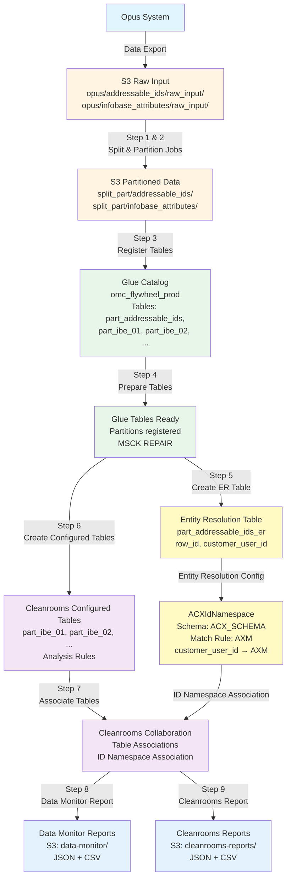

# Data Flow Diagram: Opus → Cleanrooms Collaboration

## Overview

This document depicts the complete data flow from source systems (Opus) through data processing to Cleanrooms collaboration, showing how data transforms at each stage.

## High-Level Data Flow

```
┌─────────────┐
│    OPUS    │  Source System
│  (External)│
└──────┬──────┘
       │
       │ Data Export
       │ (CSV/Parquet)
       ▼
┌─────────────────────────────────────────────────────────┐
│              RAW INPUT (S3)                            │
│  s3://bucket/opus/                                      │
│  ├── addressable_ids/raw_input/                        │
│  │   └── snapshot_dt=YYYY-MM-DD/                       │
│  │       └── [parquet files]                           │
│  └── infobase_attributes/raw_input/                   │
│      └── snapshot_dt=YYYY-MM-DD/                       │
│          └── [setup file(s)]  ← Single file, not organized│
└─────────────────────────────────────────────────────────┘
       │
       │ Step 1 & 2: Split and Partition Jobs
       │ (etl-omc-flywheel-*-split-and-part)
       │
       ▼
┌─────────────────────────────────────────────────────────┐
│         PARTITIONED TABLES (S3 + Glue Catalog)         │
│  s3://bucket/omc_cleanroom_data/split_part/             │
│  ├── addressable_ids/                                  │
│  │   └── snapshot_dt=YYYY-MM-DD/                       │
│  └── infobase_attributes/                              │
│      └── snapshot_dt=YYYY-MM-DD/                       │
│          ├── IBE_01/                                    │
│          ├── IBE_02/                                    │
│          └── ...                                       │
│                                                         │
│  Glue Database: omc_flywheel_{env}_clean               │
│  Tables: part_ibe_01, part_ibe_02, part_miacs_01, ... │
│  (External tables pointing to S3 partitions)           │
└─────────────────────────────────────────────────────────┘
       │
       │ Step 3: Register Part Tables
       │ Step 4: Prepare Part Tables (MSCK REPAIR)
       │
       ▼
┌─────────────────────────────────────────────────────────┐
│         PARTITIONED TABLES READY                        │
│  Glue Database: omc_flywheel_{env}_clean               │
│  - part_addressable_ids (source for ER)                 │
│  - part_ibe_01, part_ibe_02, part_miacs_01, ...        │
└─────────────────────────────────────────────────────────┘
       │
       │ Step 5: Create ER Table
       │ (create-part-addressable-ids-er-table)
       │
       ▼
┌─────────────────────────────────────────────────────────┐
│      ENTITY RESOLUTION TABLE                            │
│  Table: part_addressable_ids_er                        │
│  Columns:                                               │
│  - row_id (from customer_user_id)                      │
│  - customer_user_id (for AXM matching)                 │
│  Location: s3://bucket/omc_cleanroom_data/identity/    │
└─────────────────────────────────────────────────────────┘
       │
       │ Entity Resolution Configuration
       │
       ▼
┌─────────────────────────────────────────────────────────┐
│      ACXIdNamespace (Entity Resolution)                 │
│  - Input: part_addressable_ids_er table                 │
│  - Schema: ACX_SCHEMA                                   │
│  - Match Rule: AXM (customer_user_id → AXM)            │
│  - Matching: ONE_TO_ONE, EXACT match                    │
└─────────────────────────────────────────────────────────┘
       │
       │ Step 6: Configure Tables
       │
       ▼
┌─────────────────────────────────────────────────────────┐
│         CONFIGURED TABLES (Cleanrooms)                 │
│                                                         │
│  Created from Glue tables via:                         │
│  - Terraform (infra/modules/crconfigtables)            │
│  - Scripts (create-cleanrooms-configured-tables.py)    │
│                                                         │
│  Configured Tables:                                    │
│  - part_ibe_01                                         │
│  - part_ibe_02                                         │
│  - part_miacs_01                                       │
│  - ... (25 tables max per collaboration)               │
│                                                         │
│  Each configured table includes:                       │
│  - Analysis Rules (DIRECT_QUERY, CUSTOM)               │
│  - Allowed Columns (from Glue schema)                  │
│  - Table Reference (Glue database.table)                │
└─────────────────────────────────────────────────────────┘
       │
       │ Step 7: Create Associations
       │ (manage-collaboration-invites.py)
       │
       ▼
┌─────────────────────────────────────────────────────────┐
│      CLEANROOMS COLLABORATION                           │
│                                                         │
│  Collaboration: {collaboration-id}                      │
│  Membership: {membership-id}                           │
│                                                         │
│  Configured Table Associations:                       │
│  - acx_part_ibe_01 → part_ibe_01 configured table     │
│  - acx_part_ibe_02 → part_ibe_02 configured table     │
│  - acx_part_miacs_01 → part_miacs_01 configured table  │
│  - ... (up to 25 tables)                               │
│                                                         │
│  ID Namespace Association:                             │
│  - ACXIdNamespace → Entity Resolution namespace        │
│    - Uses part_addressable_ids_er table                │
│    - AXM match rule (customer_user_id → AXM)           │
│    - Enables identity matching with AMC                │
│                                                         │
│  IAM Role: cleanrooms-glue-s3-access                   │
│  (Grants Cleanrooms access to Glue/S3)                  │
│                                                         │
│  Result: Data available for collaborative analysis     │
│  with Entity Resolution identity matching              │
└─────────────────────────────────────────────────────────┘
       │
       │ Step 8 & 9: Generate Reports (Parallel)
       │
       ├─────────────────────────────────────────────────┐
       │                                                 │
       ▼                                                 ▼
┌──────────────────────────────────────┐  ┌──────────────────────────────────────┐
│   DATA MONITOR REPORT                │  │   CLEANROOMS REPORT                   │
│   (Step 8)                           │  │   (Step 9)                           │
│                                      │  │                                      │
│  Job: generate-data-monitor-report  │  │  Job: generate-cleanrooms-report     │
│                                      │  │                                      │
│  Output Location:                    │  │  Output Location:                    │
│  s3://{analysis-bucket}/             │  │  s3://{analysis-bucket}/            │
│    data-monitor/                     │  │    cleanrooms-reports/               │
│                                      │  │                                      │
│  Reports Generated:                 │  │  Reports Generated:                 │
│  - ACX_Data_Monitor_Report_          │  │  - ACX_Cleanroom_Report_             │
│    YYYY-MM-DD.json                  │  │    {collab}_YYYYMMDD.json            │
│  - ACX_Data_Monitor_Report_          │  │  - ACX_Cleanroom_Report_             │
│    YYYY-MM-DD.csv                   │  │    {collab}_YYYYMMDD_Tables.csv      │
│                                      │  │  - ACX_Cleanroom_Report_             │
│  Contents:                          │  │    {collab}_YYYYMMDD_                │
│  - Table health status               │  │    IdentityResolution.csv            │
│  - Partition counts                  │  │                                      │
│  - Schema validation                 │  │  Contents:                           │
│  - Record count comparisons          │  │  - Configured table status           │
│  - Quality metrics (NULLs, dupes)    │  │  - Association status                │
│  - Snapshot freshness                │  │  - Analysis rules & providers        │
│  - File size issues                  │  │  - ID namespace details             │
│  - SNS alerts (if issues found)     │  │  - Entity Resolution resources       │
│                                      │  │  - Ready for analysis status        │
└──────────────────────────────────────┘  └──────────────────────────────────────┘
```

## Detailed Stage-by-Stage Flow

### Stage 1: Opus → Raw Input

**Source:** Opus (external system)

**Destination:** S3 Raw Input Bucket

**Location:**
```
s3://omc-flywheel-data-us-east-1-{env}/opus/
├── addressable_ids/raw_input/
│   └── snapshot_dt=YYYY-MM-DD/
│       └── [parquet files]
└── infobase_attributes/raw_input/
    └── snapshot_dt=YYYY-MM-DD/
        └── [setup file(s)]  ← Single file(s), not organized by table
```

**Characteristics:**
- Snapshot-based partitioning (`snapshot_dt=YYYY-MM-DD`)
- Raw data format (CSV or Parquet)
- **Addressable IDs**: Already organized files
- **Infobase Attributes**: Single setup file(s) - split job creates table-organized files
- Two main data types: `addressable_ids` and `infobase_attributes`

---

### Stage 2: Raw Input → Partitioned Tables

**Process:** Split and Partition Jobs (Steps 1 & 2)

**Jobs:**
1. `etl-omc-flywheel-{env}-addressable-split-and-part`
2. `etl-omc-flywheel-{env}-infobase-split-and-part`

**Input:**
- Source: `s3://bucket/opus/{type}/raw_input/snapshot_dt={date}/`
- CSV mapping files for column transformations

**Output:**
```
s3://omc-flywheel-data-us-east-1-{env}/omc_cleanroom_data/split_part/
├── addressable_ids/
│   └── snapshot_dt=YYYY-MM-DD/
│       └── [partitioned parquet files]
└── infobase_attributes/
    └── snapshot_dt=YYYY-MM-DD/
        ├── IBE_01/        ← Created by split job
        ├── IBE_02/        ← Created by split job
        ├── IBE_03/        ← Created by split job
        ├── IBE_04/        ← Created by split job
        ├── IBE_05/        ← Created by split job
        ├── IBE_06/        ← Created by split job
        ├── IBE_08/        ← Created by split job
        ├── IBE_09/        ← Created by split job
        ├── MIACS_01/      ← Created by split job
        ├── MIACS_02/      ← Created by split job
        ├── MIACS_03/      ← Created by split job
        ├── MIACS_04/      ← Created by split job
        ├── new_borrowers/ ← Created by split job
        └── n_a/           ← Created by split job
```

**Glue Catalog Tables Created:**
- Database: `omc_flywheel_{env}_clean`
- Tables: `part_ibe_01`, `part_ibe_02`, `part_miacs_01`, etc.
- Type: External tables pointing to S3 partitions
- Partition Key: `snapshot_dt` (string)

**What Happens:**
1. Reads raw input data
   - **Addressable IDs**: Reads from organized files
   - **Infobase Attributes**: Reads from single setup file(s) and splits into table-organized files
2. Applies column mappings and transformations
3. Creates partitioned Parquet files organized by table (IBE_01, IBE_02, MIACS_01, etc.)
4. Optimizes for time-series queries with date partitioning
5. Registers tables in Glue catalog (Step 3: `register-part-tables`)
6. Prepares partitions (Step 4: `prepare-part-tables` with MSCK REPAIR)

**Key Features:**
- ✅ Time-series partitioning by `snapshot_dt`
- ✅ Optimized for Athena queries
- ✅ Dynamic partition discovery
- ✅ Incremental updates (only replaces partitions being written)

---

### Stage 3: Partitioned Tables → Configured Tables

**Process:** Create Cleanrooms Configured Tables

**Methods:**
1. **Terraform** (`infra/modules/crconfigtables`)
2. **Python Scripts** (`create-cleanrooms-configured-tables.py`)

**Input:**
- Glue tables: `part_ibe_01`, `part_ibe_02`, etc.
- Glue database: `omc_flywheel_{env}_clean`

**Output:**
- Cleanrooms Configured Tables
- Analysis Rules (DIRECT_QUERY, CUSTOM)
- Allowed columns (from Glue schema)

**Configuration:**
```hcl
# Example Terraform configuration
resource "aws_cleanrooms_configured_table" "ct" {
  name            = "part_ibe_01"
  description     = "Partitioned table part_ibe_01 for Clean Rooms analysis"
  analysis_method = "DIRECT_QUERY"
  allowed_columns = [/* all columns from Glue table */]
  
  table_reference {
    database_name = "omc_flywheel_prod"
    table_name    = "part_ibe_01"
  }
}
```

**What Happens:**
1. Reads Glue table schema (columns, data types)
2. Creates configured table in Cleanrooms
3. Creates analysis rule (DIRECT_QUERY or CUSTOM)
4. Configures allowed columns (all columns by default)
5. Links to Glue table via table reference

**Key Features:**
- ✅ Automatic column discovery from Glue
- ✅ Analysis rules for query protection
- ✅ IAM role for Cleanrooms access (`cleanrooms-glue-s3-access`)
- ✅ Idempotent (safe to run multiple times)

---

### Stage 4: Partitioned Tables → Entity Resolution Table

**Process:** Create Entity Resolution Table (Step 5)

**Job:**
- `etl-omc-flywheel-{env}-create-part-addressable-ids-er-table`

**Input:**
- Source table: `part_addressable_ids` (from Stage 2)

**Output:**
- Entity Resolution table: `part_addressable_ids_er`
- Location: `s3://bucket/omc_cleanroom_data/identity/acx_ids_cur/`

**Table Structure:**
```sql
CREATE TABLE part_addressable_ids_er AS
SELECT
  customer_user_id as row_id,
  customer_user_id
FROM part_addressable_ids;
```

**Columns:**
- `row_id` - Unique identifier (mapped from `customer_user_id`)
- `customer_user_id` - Customer identifier used for AXM matching
  - In Entity Resolution schema, this maps to match key `AML` which is used for AXM rule matching
  - The `customer_user_id` value is matched against AMC's `AXM` identifier

**What Happens:**
1. Reads from `part_addressable_ids` partitioned table
2. Creates `part_addressable_ids_er` table with `row_id` and `customer_user_id` columns
3. Writes to S3 location for Entity Resolution Service
4. Table is ready for ACXIdNamespace configuration

**Key Features:**
- ✅ Optimized for Entity Resolution Service
- ✅ Uses `row_id` as primary identifier
- ✅ `customer_user_id` used for AXM match rule

---

### Stage 5: Entity Resolution Table → ACXIdNamespace

**Process:** Configure Entity Resolution ID Namespace

**Components:**
1. **ID Namespace:** `ACXIdNamespace`
   - Type: `SOURCE`
   - Input Source: `part_addressable_ids_er` Glue table
   - Schema: `ACX_SCHEMA`

2. **Schema Mapping:** `ACX_SCHEMA`
   - Field: `customer_user_id` → Match Key: `AML` (used for AXM matching)
   - Field: `email` → Match Key: `EMAIL` (optional)

3. **Match Rule:** `AXM`
   - Rule Type: `EXACT`
   - Source Attribute: `customer_user_id` (maps to `row_id` in table)
   - Target Attribute: `AXM` (AMC's matching key)
   - Matching Model: `ONE_TO_ONE`

**Configuration:**
```json
{
  "idMappingType": "RULE_BASED",
  "ruleBasedProperties": {
    "ruleDefinitionType": "TARGET",
    "attributeMatchingModel": "ONE_TO_ONE",
    "recordMatchingModel": "ONE_SOURCE_TO_ONE_TARGET",
    "rules": [
      {
        "ruleName": "Exact_AXM",
        "matchingKeys": ["AXM"]
      }
    ]
  }
}
```

**What Happens:**
1. `part_addressable_ids_er` table provides identity data
2. ACXIdNamespace reads from this table using ACX_SCHEMA
3. Schema maps `customer_user_id` to match key `AML` (for AXM rule)
4. Entity Resolution matches ACX `customer_user_id` to AMC `AXM` identifier
5. ID namespace associated with Cleanrooms collaboration

**Key Features:**
- ✅ `row_id` column used as unique identifier
- ✅ `customer_user_id` column used for AXM matching
- ✅ One-to-one matching model
- ✅ Exact match rule for AXM key

---

### Stage 7: Configured Tables → Cleanrooms Collaboration

**Process:** Associate Configured Tables to Collaboration

**Methods:**
1. **Terraform** (`infra/modules/crassociations`)
2. **Python Scripts** (`manage-collaboration-invites.py`)

**Input:**
- Configured table IDs
- Collaboration membership ID
- IAM role ARN (`cleanrooms-glue-s3-access`)
- ID Namespace ARN (`ACXIdNamespace`)

**Output:**
- Configured Table Associations
- Collaboration Analysis Rules
- ID Namespace Association
- Data available for collaborative analysis

**Configuration:**
```python
# Example association creation
aws cleanrooms create-configured-table-association \
  --collaboration-identifier {collaboration-id} \
  --configured-table-identifier {configured-table-id} \
  --name acx_part_ibe_01 \
  --role-arn arn:aws:iam::{account}:role/cleanrooms-glue-s3-access

# ID Namespace association
aws cleanrooms create-id-namespace-association \
  --membership-identifier {membership-id} \
  --id-namespace-arn arn:aws:entityresolution:us-east-1:239083076653:idnamespace/ACXIdNamespace
```

**What Happens:**
1. Accepts collaboration invite (if new)
2. Discovers configured tables (filters `part_*`, excludes `n_a`, limits to 25)
3. Creates associations with naming: `acx_{table_name}`
4. Creates collaboration-level analysis rules
5. Associates ACXIdNamespace to collaboration
6. Configures IAM role for data access

**Key Features:**
- ✅ Dynamic table discovery
- ✅ Automatic quota management (25 tables max)
- ✅ Collaboration analysis rules
- ✅ ID Namespace association for Entity Resolution
- ✅ Idempotent (two-phase: delete all, then create all)

**Limitations:**
- Maximum 25 configured table associations per collaboration
- Must exclude `part_n_a` and `part_n_a_a` if quota is tight
- Tables must have analysis rules before association

---

### Stage 8: Data Monitoring Report Generation

**Process:** Generate Data Quality Monitoring Report (Step 6)

**Job:**
- `etl-omc-flywheel-{env}-generate-data-monitor-report`

**Input:**
- Glue database: `omc_flywheel_{env}_clean`
- Table prefix: `part_`
- Source tables for comparison (optional)

**Output:**
```
s3://{analysis-bucket}/data-monitor/
├── ACX_Data_Monitor_Report_YYYY-MM-DD.json
└── ACX_Data_Monitor_Report_YYYY-MM-DD.csv
```

**Report Contents:**
- **Table Health Status**: Overall status per table
- **Partition Information**:
  - S3 partition count
  - Glue partition count
  - Missing partitions
- **Schema Validation**:
  - Table type validation
  - Schema contract compliance
- **Data Quality Metrics**:
  - Record counts (source vs partitioned)
  - Count difference percentage
  - Primary key NULLs
  - Primary key duplicates
- **Snapshot Information**:
  - Raw input snapshot date
  - Snapshot freshness
- **File Issues**:
  - File size anomalies (if enabled)
- **Alerts**: SNS notifications for issues

**What Happens:**
1. Scans all `part_*` tables in Glue database
2. Validates schema and partition structure
3. Compares record counts (if enabled)
4. Checks data quality (NULLs, duplicates)
5. Validates snapshot freshness
6. Generates JSON and CSV reports
7. Publishes SNS alerts if issues found

**Key Features:**
- ✅ Comprehensive data quality monitoring
- ✅ Partition health validation
- ✅ Schema contract enforcement
- ✅ Automated alerting via SNS
- ✅ Snapshot tracking and freshness checks

---

### Stage 9: Cleanrooms Report Generation

**Process:** Generate Cleanrooms Resource Report (Step 7)

**Job:**
- `etl-omc-flywheel-{env}-generate-cleanrooms-report`

**Input:**
- Cleanrooms membership ID
- Glue database: `omc_flywheel_{env}_clean`
- Table prefix: `part_`
- Report output S3 bucket

**Output:**
```
s3://{analysis-bucket}/cleanrooms-reports/
├── ACX_Cleanroom_Report_{collab}_YYYYMMDD.json
├── ACX_Cleanroom_Report_{collab}_YYYYMMDD_Tables.csv
└── ACX_Cleanroom_Report_{collab}_YYYYMMDD_IdentityResolution.csv
```

**Report Contents:**

**Tables Report (CSV):**
- Collaboration name and ID
- Table name and Glue status
- Configured table status and ARN
- Association status and name
- Analysis rules (configured table and collaboration)
- Allowed query providers (account IDs with descriptions)
- Ready for analysis status
- Column counts and configuration

**Identity Resolution Report (CSV):**
- ID namespace name and ARN
- ID namespace method
- Source database, region, and table
- Schema mapping name
- Unique ID field
- Input fields and match keys
- Entity Resolution namespace details

**JSON Report:**
- Complete resource data with metadata
- Summary statistics
- Collaboration details
- All tables and associations
- Identity Resolution resources

**What Happens:**
1. Retrieves all Glue tables matching prefix
2. Fetches Cleanrooms configured tables
3. Retrieves collaboration associations
4. Extracts analysis rules and providers
5. Retrieves Identity Resolution resources (ID namespaces, schema mappings)
6. Generates comprehensive reports in JSON and CSV formats

**Key Features:**
- ✅ Complete Cleanrooms resource inventory
- ✅ Association and analysis rule tracking
- ✅ Identity Resolution integration
- ✅ Provider account tracking with descriptions
- ✅ Dual format output (JSON + CSV)
- ✅ Collaboration-specific reporting

---

## Complete Data Flow Summary

| Stage | Source | Destination | Process | Output |
|-------|--------|-------------|---------|--------|
| **1. Opus Export** | Opus System | S3 Raw Input | Data export | `opus/{type}/raw_input/snapshot_dt={date}/` |
| **2. Split & Partition** | S3 Raw Input | S3 Partitioned + Glue | Split jobs | `split_part/{type}/snapshot_dt={date}/` + `part_*` tables |
| **3. Register Tables** | S3 Partitioned | Glue Catalog | Register job | External tables in Glue |
| **4. Prepare Tables** | Glue Tables | Glue Tables | MSCK REPAIR | Partitioned tables ready |
| **5. Create ER Table** | `part_addressable_ids` | `part_addressable_ids_er` | ER table job | ER table with `row_id` and `customer_user_id` |
| **6. Configure ER** | ER Table | ACXIdNamespace | Entity Resolution | ID namespace with AXM match rule |
| **7. Configure Tables** | Glue Tables | Cleanrooms | Terraform/Script | Configured tables with rules |
| **8. Associate Tables** | Configured Tables + ID Namespace | Collaboration | Script | Associations in collaboration |
| **9. Data Monitor Report** | All `part_*` Tables | S3 Reports | Monitoring job | Data quality reports (JSON + CSV) |
| **10. Cleanrooms Report** | Cleanrooms Resources | S3 Reports | Reporting job | Cleanrooms status reports (JSON + CSV) |

## Data Locations Reference

### Dev Environment

```
S3 Bucket: omc-flywheel-data-us-east-1-dev
├── opus/
│   ├── addressable_ids/raw_input/snapshot_dt=YYYY-MM-DD/
│   └── infobase_attributes/raw_input/snapshot_dt=YYYY-MM-DD/
└── omc_cleanroom_data/
    └── split_part/
        ├── addressable_ids/snapshot_dt=YYYY-MM-DD/
        └── infobase_attributes/snapshot_dt=YYYY-MM-DD/

Glue Database: omc_flywheel_dev_clean
Tables: part_ibe_01, part_ibe_02, part_miacs_01, ...

Analysis Bucket: omc-flywheel-dev-analysis-data
├── data-monitor/
│   ├── ACX_Data_Monitor_Report_YYYY-MM-DD.json
│   └── ACX_Data_Monitor_Report_YYYY-MM-DD.csv
└── cleanrooms-reports/
    ├── ACX_Cleanroom_Report_{collab}_YYYYMMDD.json
    ├── ACX_Cleanroom_Report_{collab}_YYYYMMDD_Tables.csv
    └── ACX_Cleanroom_Report_{collab}_YYYYMMDD_IdentityResolution.csv
```

### Production Environment

```
S3 Bucket: omc-flywheel-data-us-east-1-prod
├── opus/
│   ├── addressable_ids/raw_input/snapshot_dt=YYYY-MM-DD/
│   └── infobase_attributes/raw_input/snapshot_dt=YYYY-MM-DD/
└── omc_cleanroom_data/
    └── split_part/
        ├── addressable_ids/snapshot_dt=YYYY-MM-DD/
        └── infobase_attributes/snapshot_dt=YYYY-MM-DD/

Glue Database: omc_flywheel_prod
Tables: part_ibe_01, part_ibe_02, part_miacs_01, ...

Analysis Bucket: omc-flywheel-prod-analysis-data
├── data-monitor/
│   ├── ACX_Data_Monitor_Report_YYYY-MM-DD.json
│   └── ACX_Data_Monitor_Report_YYYY-MM-DD.csv
└── cleanrooms-reports/
    ├── ACX_Cleanroom_Report_{collab}_YYYYMMDD.json
    ├── ACX_Cleanroom_Report_{collab}_YYYYMMDD_Tables.csv
    └── ACX_Cleanroom_Report_{collab}_YYYYMMDD_IdentityResolution.csv
```

## Key Components

### IAM Roles

1. **Glue Job Role** (`omc-flywheel-{env}-glue-role`)
   - Reads from `opus/` raw input
   - Writes to `omc_cleanroom_data/split_part/`
   - Creates/updates Glue tables

2. **Cleanrooms Access Role** (`cleanrooms-glue-s3-access`)
   - Grants Cleanrooms access to Glue catalog
   - Grants Cleanrooms access to S3 data
   - Used by configured table associations

### Automation

1. **Step Functions** (`omc-flywheel-{env}-db-refresh`)
   - Orchestrates Steps 1-7 of database refresh
   - Monthly scheduled execution
   - Parallel execution for split jobs

2. **Local Scripts**
   - `run-dev-db-refresh.sh` / `run-prod-db-refresh.sh`
   - `orchestrate-db-refresh.py`
   - `manage-collaboration-invites.py`

3. **Terraform**
   - `infra/modules/crconfigtables` - Creates configured tables
   - `infra/modules/crassociations` - Associates tables to collaborations

## Mermaid Diagram



## Related Documentation

- [CURRENT_PROCESS_FLOW.md](./CURRENT_PROCESS_FLOW.md) - Detailed process flow
- [PRODUCTION_RUN_SEQUENCE.md](./PRODUCTION_RUN_SEQUENCE.md) - Production run steps
- [STEP_FUNCTIONS_ORCHESTRATION.md](./STEP_FUNCTIONS_ORCHESTRATION.md) - Automation orchestration
- [COLLABORATION_MANAGEMENT.md](./COLLABORATION_MANAGEMENT.md) - Collaboration setup

